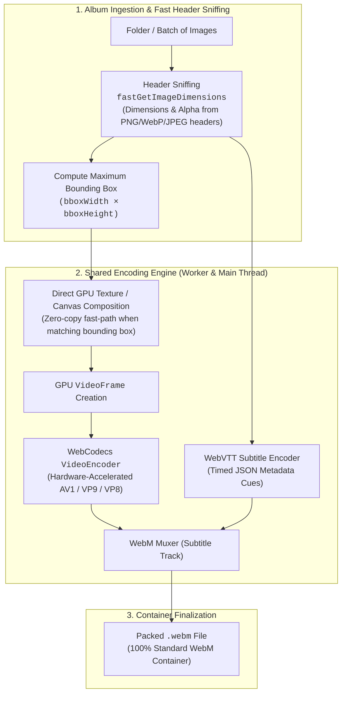
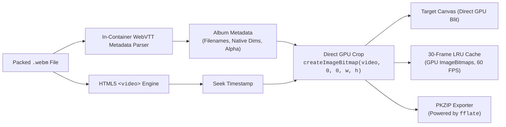

<p align="center">
  
</p>

<h1 align="center">av1pack</h1>

<p align="center">
  <strong>Visually lossless image album compression using next-gen video codecs directly in your browser.</strong>
</p>

---

## Overview

**av1pack** compresses an entire photo album into a single high-efficiency video container (`.webm`). 

Traditional archivers (ZIP, 7z) compress images independently as generic byte streams. However, photos in an album frequently share the same lighting, color palette, sensor noise, and scene backgrounds. By sequencing images as video frames, **av1pack** takes advantage of modern inter-frame and spatial prediction in video codecs (AV1, VP9, VP8) to achieve **up to 50% better compression** than generic archives, while maintaining visual losslessness and doubling as an instant slideshow.

All original image filenames, native dimensions, and alpha channels are stored directly inside the container as a synchronized in-band **WebVTT timed metadata track** (`V_TEXT/WEBVTT`). Because the metadata is a standard container track, the file is 100% compliant with standard media players and survives `ffmpeg -c copy`, video editors, and cloud sharing platforms.

---

## Internal Architecture & Diagrams

av1pack is 100% client-side. The diagrams below illustrate the encoding flow, in-container layout, and decoding/scrubbing pipeline.

### 1. Encoding Pipeline



### 2. In-Container Layout

Metadata is stored natively inside the WebM container as a WebVTT track, eliminating extraneous trailing non-container bytes:

```
┌─────────────────────────────────────────────────────────────┐
│                    WebM Container (EBML)                    │
│                                                             │
│  Track 1: Video Track (AV1 / VP9 / VP8)                     │
│  • Padded frames: (bboxWidth × bboxHeight)                  │
│  • Playable as an ordinary video in any player or browser   │
│                                                             │
│  Track 2: WebVTT Timed Metadata Track (V_TEXT/WEBVTT)       │
│  • Cue 1: [00:00.000 --> 00:00.033] {"filename", "w", "h"} │
│  • Cue 2: [00:00.033 --> 00:00.066] {"filename", "w", "h"} │
│  • Pure in-container track; survives ffmpeg -c copy & upload│
└─────────────────────────────────────────────────────────────┘
```

### 3. Decoding & Extraction Pipeline



---

## Key Features

- **100% Client-Side & Private**: Runs entirely in your browser sandbox using WebCodecs and the File System Access API. Zero bytes are uploaded to any server.
- **In-Container WebVTT Metadata**: Stores frame metadata directly inside the container as a WebVTT track so it survives video remuxers (`ffmpeg -c copy -map 0`), social media uploads, and video trimming.
- **Hardware-Accelerated Codecs**: Automatically detects GPU hardware encoding for **AV1**, **VP9**, and **VP8**.
- **Unified Engine**: Common encoding engine shared between background Web Workers and the main thread fallback.
- **Zero-Copy Frame Pipeline**:
  - *Encoding*: Uniform-sized images pass directly from `ImageBitmap` to `VideoFrame` without canvas blitting.
  - *Decoding*: Frames crop directly on the GPU texture via `createImageBitmap(video, 0, 0, w, h)`, completely avoiding intermediate canvases and PCIe CPU readbacks (`getImageData`).
- **Zero-CPU-Readback Alpha Detection**: Inspects image headers (PNG `IHDR`, WebP `VP8X`, GIF `GCE`, JPEG) directly without expensive canvas pixel loops.
- **Interactive Frame Reader**:
  - 60 FPS stutter-free scrubbing powered by an internal LRU frame cache.
  - Automatic cropping back to each image's native resolution.
  - Built-in slideshow viewer and photo metadata inspector.
- **High-Performance ZIP Extraction**: Generates standard PKZIP archives in-memory using the battle-tested `fflate` library.
- **Modern File System Access**: Drag & drop entire directories or use native operating system folder pickers and save dialogs.

---

## Compression Benchmark

Testing against the `gov_small` dataset shows **av1pack** outperforming maximum ZIP compression:

<p align="center">
  
</p>

| Format | Size | Reduction vs Original |
| :--- | :--- | :--- |
| **Original Photos (PNG / JPEG)** | 10,197 KB | Baseline |
| **Standard Archive (`zip -9`)** | 9,800 KB | ~3.9% |
| **av1pack (Video Container)** | **5,412 KB** | **~46.9%** |

> [!NOTE]
> Benchmark test dataset files are available on [MEGA](https://mega.nz/folder/ByxhSCZQ#TCxSIJBMlo5Y_0ijU2g8qg). Output size and compression ratio depend on image similarity and chosen encoder quality.

---

## Running Locally

### Prerequisites
- [Bun](https://bun.sh/) (or Node.js 18+)
- A modern Chromium-based browser (Chrome, Edge, Brave) for full WebCodecs and File System Access API support.

### Setup & Development

```bash
# Clone the repository
git clone https://github.com/davidnoronha1/av1pack.git
cd av1pack/web

# Install dependencies
bun install

# Start local Vite development server
bun run dev
```

### Production Build & Deploy

```bash
# Build production bundle (outputs to web/dist)
bun run build

# Deploy to Cloudflare Workers (optional)
bun run deploy
```

---

## License

This project is licensed under the [MIT License](./LICENSE).
